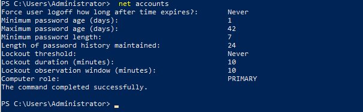
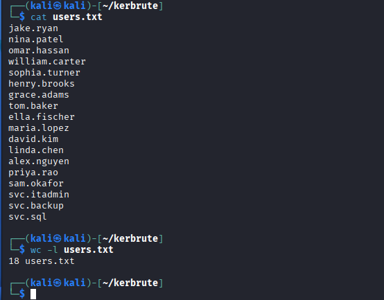
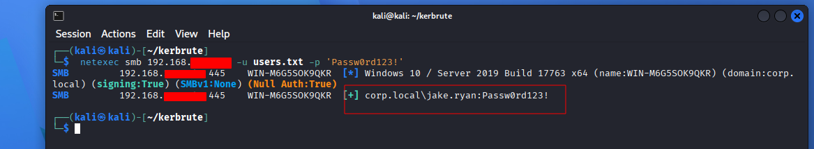
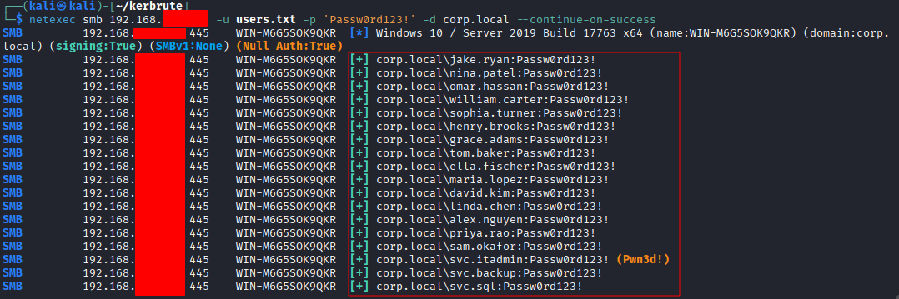
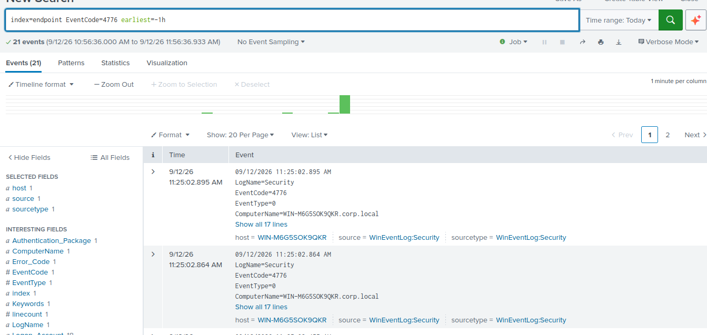
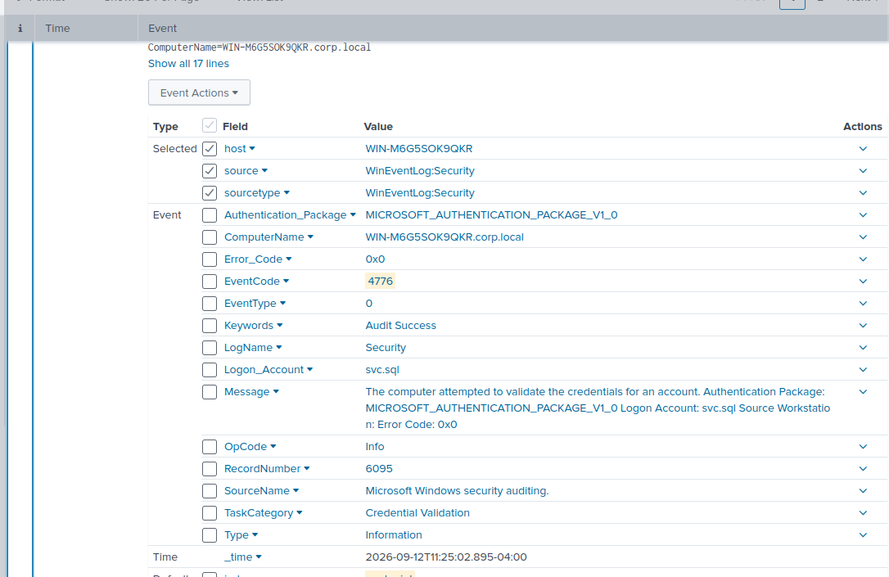
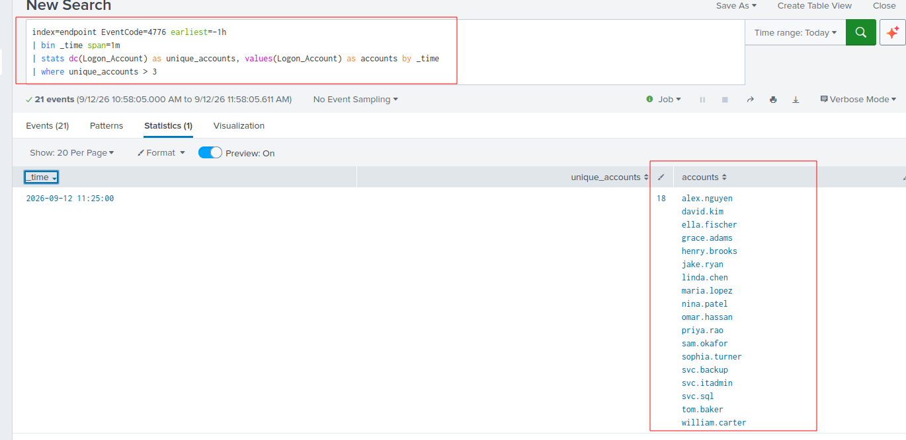
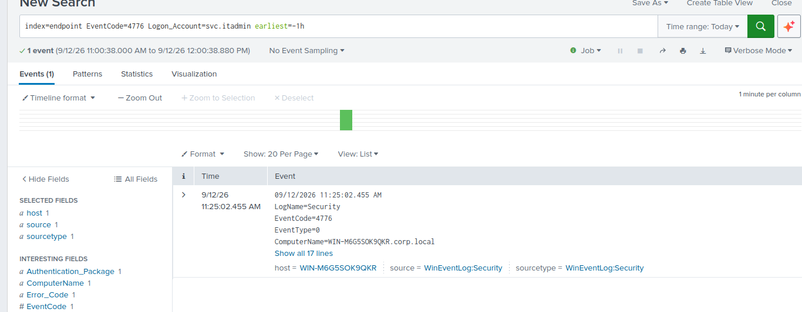

# Detection: Password Spraying Against Active Directory

**ATT&CK Technique:** [T1110.003 - Brute Force: Password Spraying](https://attack.mitre.org/techniques/T1110/003/)
**Environment:** `corp.local`- Windows Server 2019 DC, 18 domain accounts
**Attacker host:** Kali Linux
**Log source:** Windows Security event log, forwarded via Splunk UF → Splunk `endpoint` index

## Summary

A password spray was run against every account in the domain using a single
weak/reused password. The attack succeeded against **all 18 accounts**,
including the domain's dedicated administrative account (`svc.itadmin`). The
resulting authentication events were used to build a detection query that
flags a burst of distinct accounts authenticating within a tight time window
— the core fingerprint that separates a spray from normal login traffic or a
single-account brute force.

## 1. Baseline: Domain Lockout Policy

Before attacking, the domain's account lockout policy was checked. This
matters for planning: a spray against a domain with a low lockout threshold
risks locking out every account in one run, while an unset policy (as found
here) means brute-force/spray attempts can run indefinitely with no
built-in throttling, a common real-world misconfiguration.

```powershell
net accounts
```



**Finding:** `Lockout threshold: Never` - no account lockout policy is
configured on this domain, meaning credential attacks against it face no
automatic throttling or blocking.

## 2. Attack Setup - Target List

An account list was built from the org's known usernames (in a real
engagement this step would typically follow OSINT/enumeration; here the
accounts were already known from provisioning the lab):

```bash
cat users.txt
wc -l users.txt
```



18 accounts targeted, spanning all 5 departments plus the 3 service/admin
accounts built for later attack scenarios.

## 3. Running the Spray

Initial run confirmed the technique against a single account:

```bash
netexec smb <dc-ip> -u users.txt -p 'Passw0rd123!' -d corp.local
```



Re-run with `--continue-on-success` so the tool doesn't stop after the first
valid credential, sweeping the full list:

```bash
netexec smb <dc-ip> -u users.txt -p 'Passw0rd123!' -d corp.local --continue-on-success
```



**Result:** All 18 accounts authenticated successfully with the same
password including `svc.itadmin`, the domain's Domain Admin account
(flagged `Pwn3d!` by netexec).

## 4. Investigating the Telemetry

An initial assumption was that this attack would generate Kerberos
pre-authentication events (`4768`/`4771`). A broad search across the likely
event codes showed otherwise:

```spl
index=endpoint earliest=-45m (EventCode=4768 OR EventCode=4776 OR EventCode=4624 OR EventCode=4625)
| stats count by EventCode
```

| EventCode | Count | Meaning |
|---|---|---|
| 4624 | 217 | Successful logon |
| 4625 | 1 | Failed logon |
| 4768 | 4 | Kerberos TGT request |
| 4776 | 21 | NTLM credential validation |

The attack authenticated primarily via **NTLM** (Event 4776), not Kerberos
`netexec smb` negotiates SMB authentication, which fell back to NTLM in this
environment rather than Kerberos. This is a useful finding in its own right:
**a detection built only around Kerberos event codes would have missed most
of this attack.**



Expanding a single event confirmed the relevant field for the target account
is `Logon_Account` (not `Account_Name`, which is what a Kerberos event uses)
- and that **NTLM events do not expose a usable source-IP field**, only a
free-text `Source Workstation` value buried in the `Message` field. This is
a real limitation: NTLM-based detections lose the clean source attribution
that Kerberos-based ones have.



## 5. Detection Query

```spl
index=endpoint EventCode=4776 earliest=-1h
| bin _time span=1m
| stats dc(Logon_Account) as unique_accounts, values(Logon_Account) as accounts by _time
| where unique_accounts > 3
```

**Logic:** a legitimate environment rarely sees more than a handful of
distinct accounts authenticate via NTLM within the same 60-second window.
Counting *distinct* accounts per time bucket (rather than raw event volume)
distinguishes a spray from normal traffic or a single repeatedly-failing
account (which a naive "count > N" threshold would also catch, but for the
wrong reason).



**Result:** 18 distinct accounts authenticated within a single one-minute
window at `11:25:00 AM` - every account in the domain, all at once. This is
the spray's fingerprint.

## 6. Impact: Confirming the Admin Account Was Compromised

The account list above includes `svc.itadmin`, the domain's dedicated Domain
Admin account. Isolating that specific account confirms it was directly
authenticated against during the spray:

```spl
index=endpoint EventCode=4776 Logon_Account=svc.itadmin earliest=-1h
```



**This is the critical finding.** A password spray using a single guessed
password successfully validated credentials for the domain's highest-
privilege account. In a real environment, this is a Domain Admin compromise
achieved through nothing more than a shared/weak password policy — the kind
of finding that would be rated critical in an actual assessment.

## Key Takeaways

1. **No lockout policy = no built-in throttling.** The domain's `Never`
   lockout threshold meant this spray (or a much larger one) could run
   unimpeded.
2. **Don't assume the auth protocol.** SMB-based tooling doesn't guarantee
   Kerberos events — NTLM fallback changes which event codes and fields are
   actually available for detection.
3. **NTLM events are weaker for detection than Kerberos events** due to the
   lack of a clean, indexed source-IP field.
4. **Distinct-account-count per time window** is a more robust spray
   signature than raw event volume, since it specifically targets the
   "one attacker, many accounts, short window" pattern.

## Possible Detection Improvements

- Extract `Source_Workstation` from the NTLM event's `Message` field via
  `rex` to regain partial source attribution.
- Re-run the same attack using a Kerberos-native tool (e.g. `kerbrute`) to
  compare detection fidelity between the two authentication paths.
- Layer in `Error_Code` filtering to separate successful sprays from failed
  ones, since a real attacker's spray is more often mostly failures with a
  handful of successes.
